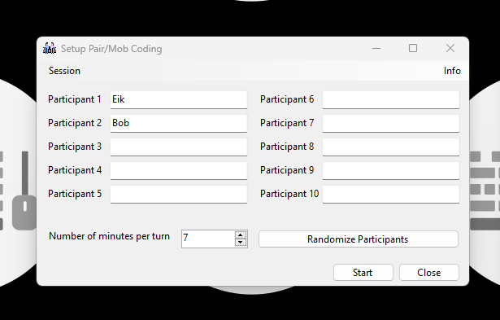

# VisualPairCoding

A small Winforms app to visually display whos turn it is when coding together in a group or in pair.

## Features

- Up to 5 Participants
- The length of the session is customizable
- Skip current "Driver" if he/she is absent
- Animation with the name of the next "Driver" when roles change

## Idea

When a PairCoding Session starts, there will be a "Driver" and a "Recommended Navigator". The "Driver" has to do the coding while being advised from the "Recommended Navigator" with coding tips. This way both the "Driver" and the "Recommended Navigator" benefit from the process and learn something new from each other.

## Preview

The Main Menu of the App

Coding Session. (Can be moved by clicking anywhere in the content of the window)

The Animation when the next driver is Up

